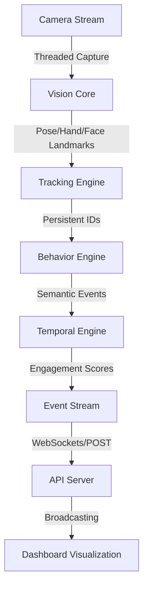

# RBIS Architecture

The system is designed as a multi-stage perception pipeline.

### Module Breakdown:

- **Vision Core**: Handles raw frame acquisition and MediaPipe inference.
- **Tracking Engine**: Maintains identity across frames using a Kalman-based SORT algorithm.
- **Behavior Engine**: Translates geometric landmarks (e.g., wrist-to-shoulder distances) into semantic events (e.g., hand raise).
- **Temporal Engine**: Smoothes short-term noise and computes time-series metrics.
- **API Server**: A high-speed FastAPI layer with WebSocket support.
- **Dashboard**: A React-based interface for real-time analytics.
